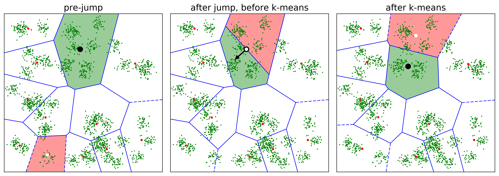

# k-means-u and k-means-u*

This repository contains example python code for the k-means-u and k-mean-u* algorithms as proposed in (enter arxiv link here).  Since the paper file size (14 MB) is still too large for arxiv (6MB max), it is currently included in the repository (kmeansustar.pdf)

## Quick Start
* clone or download https://github.com/gittar/k-means-u-star
* cd main directory
* install miniconda or anaconda: https://conda.io/docs/install/quick.html
* create kmus environment: `conda env create -f envsimple.yml`
* activate environment: `source activate kmus` (on windows: `activate kmus`)
* start one of the jupyter notebooks: `jupyter notebook algo-pure.ipynb`
* continue in the browser window which opens (jupyter manual: http://jupyter-notebook.readthedocs.io/en/latest/)

## jupyter notebooks:

* algo-pure.ipynb  
  (a bare-bones implementation meant for easy understanding of the algorithms)
* simu-detail.ipynb  
  (detailed simulations and graphics to illustrate the way the algrithms work, uses kmeansu.py)
* simu-bulk.ipynb  
  (systematic simulations with various data sets to compare k-means-++, k-means-u and k-means-u*, uses kmeansu.py)
* dataset_class.ipynb 
  (examples for using the data generator)
  
## python files:
* kmeansu.py  
  main implementation of k-means-u and k-means-u*, makes heavy use of 
  http://scikit-learn.org/stable/modules/generated/sklearn.cluster.KMeans.html for efficient implementations of k-means and k-means++, gathers certain statistics while training to enable systematic evaluation, code therefore a bit larger
* bfdataset.py  
  (contains a class "dataset" to generate test data sets and also an own implementation of k-means++ which allows to get  the codebook after initialization but before the run of k-means)
* bfutil.py  
  (various utility functions for plotting etc.)
